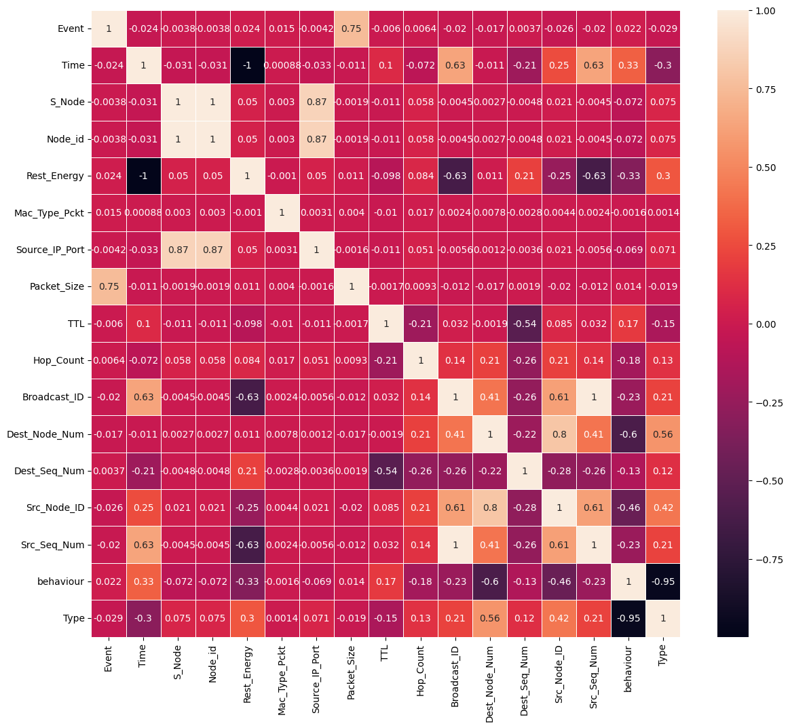
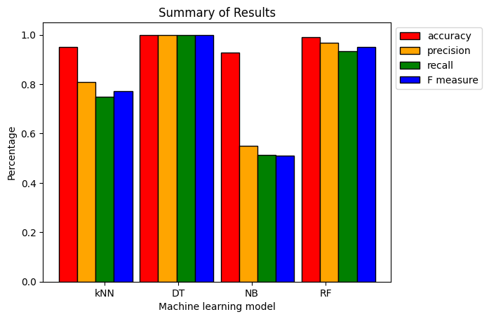
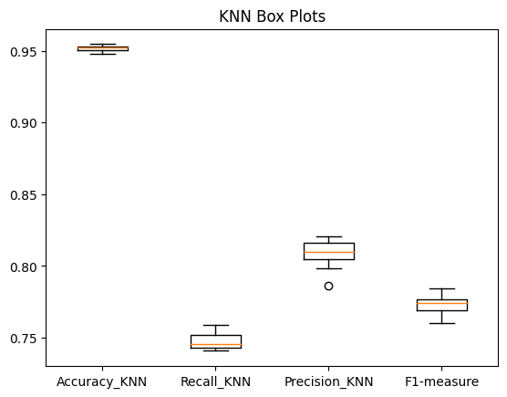
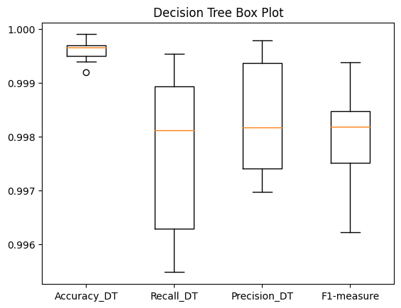
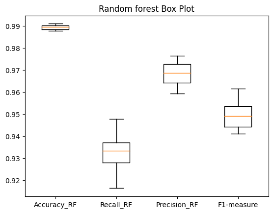
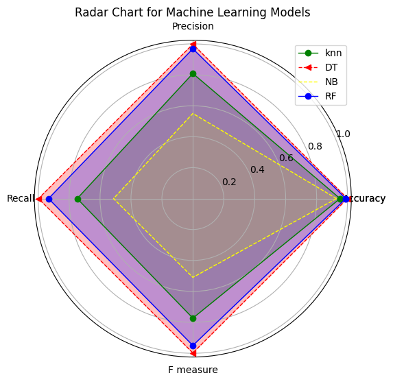

# Data Science Programming Final Submission
This repository contains the final submission for the Data Science Programming course by Yousif Qais Al-Eshari (Student ID: 22110065).

## Project Overview
This project demonstrates a complete data science workflow using a wireless sensor network dataset (WSNBFSFdataset_DSprog.csv). Where this repository delves into a thorough examination of a machine learning algorithm developed to address a critical issue in network traffic management. Network traffic is the lifeblood of modern communication systems, and excellent traffic management is critical to the seamless operation of many applications and services. To get insight into this complex domain, I used the dataset 'WSNBFSFdataset_DSprog.csv,' which contains several elements of network traffic operations. This code not only exhibits efficient data pre-processing approaches, but it also assesses the efficacy of several machine learning models in identifying and comprehending network traffic characteristics.
The notebook covers:

- Data loading and cleaning (handling missing values, duplicates, and categorical encoding)
- Exploratory Data Analysis (EDA) with visualizations
- Feature engineering and selection
- Machine learning model training and evaluation (KNN, Decision Tree, Naive Bayes, Random Forest)
- Performance comparison using accuracy, precision, recall, F1-score, and confusion matrices
- Visualization of results with bar plots, box plots, and radar 

## How to Run
1. Clone this repository to your local machine.
2. Ensure you have Python 3.x installed.
3. Place the dataset file WSNBFSFdataset_DSprog.csv in the same directory as the notebook.
4. Open Data_Science_Programming_Final.ipynb in Jupyter Notebook or VS Code.
5. Run all cells sequentially to reproduce the analysis and results.

Example Results
1. Correlation Heatmap

Shows relationships between features in the dataset. Correlation Heatmap

2. Model Performance Bar Plot

Comparison of accuracy, precision, recall, and F1-score for KNN, Decision Tree, Naive Bayes, and Random Forest. Model Performance Bar Plot

3. Box Plots for Model Metrics

Visualizes the distribution of metrics for each model. 

KNN Box Plot 

Decision Tree Box Plot 

Naive Bayes Box Plot 

Random Forest Box Plot

4. Radar Chart
Overall comparison of models across all metrics. 

Radar Chart

## Author
Name: Yousif Qais Al-Eshari
Student ID: 22110065

## License
This project is submitted for academic purposes and may not be reused without permission.

